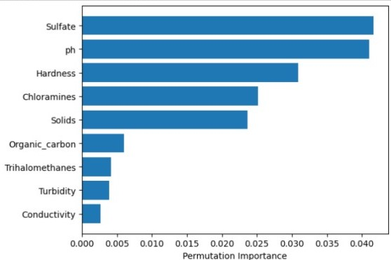

# Water Potability Analysis

## Introduction
This project develops an API to predict water potability using a machine learning model. It aims to ensure the provision of safe drinking water.

## Table of Contents
1. [Introduction](#introduction)
2. [Essential Libraries](#essential-libraries)
3. [Data Preprocessing](#data-preprocessing)
4. [Checking Correlation](#checking-correlation)
5. [Data Modeling](#data-modeling)
6. [Hyperparameter Tuning](#hyperparameter-tuning)
7. [Feature Importance](#feature-importance)
8. [API Creation](#api-creation)
9. [Prediction](#prediction)

## Introduction
Water quality is essential for human health and overall well-being. This project aims to predict
water potability, which is crucial for ensuring safe drinking water. Clean and potable water is
fundamental for preventing diseases and sustaining healthy communities. Additionally, it plays a
vital role in economic development and environmental sustainability.

Dataset was taken from [Kaggle](https://www.kaggle.com/datasets/adityakadiwal/water-potability).
## Essential Libraries
To perform data analysis, develop a model, and create the API, we'll need several libraries:
- **Data Analysis and Visualization:**
  - `matplotlib.pyplot`: For creating static, interactive, and animated visualizations.
  - `pandas`: For data manipulation and analysis.
  - `seaborn`: For statistical data visualization.
  - `numpy`: For numerical computing.

- **Machine Learning:**
  - `sklearn.model_selection`: For splitting datasets and cross-validation.
  - `sklearn.ensemble`: For ensemble-based models like RandomForest and GradientBoosting classifiers.
  - `sklearn.metrics`: For model evaluation metrics.
  - `sklearn.preprocessing`: For feature scaling and preprocessing.
  - `sklearn.svm`: For Support Vector Machine models.
  - `sklearn.tree`: For Decision Tree models.
  - `sklearn.model_selection`: For hyperparameter tuning using GridSearchCV.
  - `sklearn.inspection`: For model inspection and permutation importance.

- **Model Persistence:**
  - `joblib`: For saving and loading machine learning models.

- **API Framework:**
  - `fastapi`: For creating a modern, fast web API.
  - `fastapi.templating`: For integrating Jinja2 templates with FastAPI.
  - `pydantic`: For data validation and settings management using Python type annotations.

- **Data Encoding:**
  - `json`: For parsing JSON data format.

## Data Preprocessing

### Handling Missing Values

During the data preprocessing phase, missing values were identified in three features: pH, Sulfate, and Trihalomethanes. To address this, the missing values were replaced with the mean of their respective columns as follows:

- For pH missing values: `df['ph'].fillna(value=df['ph'].mean(), inplace=True)`
- For Sulfate missing values: `df['Sulfate'].fillna(value=df['Sulfate'].mean(), inplace=True)`
- For Trihalomethanes missing values: `df['Trihalomethanes'].fillna(value=df['Trihalomethanes'].mean(), inplace=True)`

This approach ensures that the dataset is complete and avoids any bias or errors in the model due to missing data.
### Handling Outliers


Outliers in the dataset were addressed to ensure the robustness of the model. Given that the outliers were not numerous, the decision was made to remove them.

#### Method
Outliers were identified and removed using the Interquartile Range (IQR) method. The IQR is calculated as the difference between the 75th and 25th percentiles (Q3 and Q1). Data points that fall below `Q1 - 1.5 * IQR` or above `Q3 + 1.5 * IQR` are considered outliers. The code snippet for outlier removal is as follows:

```python
Q1 = df.quantile(0.25)
Q3 = df.quantile(0.75)
IQR = Q3 - Q1
df = df[~((df < (Q1 - 1.5 * IQR)) | (df > (Q3 + 1.5 * IQR))).any(axis=1)]
```
## Checking Correlation

### Heatmaps for Correlation Analysis

The analysis of feature correlations was performed using heatmaps to understand the relationships between different variables. The heatmap illustrated below indicates that there is no significant linear relationship between the features, which led to the decision to utilize a non-linear model for the project.

## Data Modeling

### Splitting and Transforming Data

Initially, the dataset was divided into a training set and a testing set. This is a typical practice in machine learning to evaluate the model's performance on unseen data. To ensure that all features contribute equally to the model, scaling was performed, normalizing the feature set.

### Applying Models for Prediction

A comparison of different machine learning models was conducted to identify the most effective one for predicting water potability. The models included RandomForest, Gradient Boosting, and Support Vector Machines (SVM). Each model's accuracy was carefully assessed.


The evaluation process highlighted SVM as the best-performing model in terms of accuracy, suggesting its effectiveness in handling this particular prediction task.

## Hyperparameter Tuning

### Optimization of Model Parameters

The hyperparameters of the Support Vector Machine (SVM) model were meticulously optimized using grid search. This process involved an exhaustive search over specified parameter values for the SVM. The goal was to find the combination of parameters that resulted in the best performance of the model.

After an extensive period of fine-tuning, which took around 7 hours, the optimal hyperparameters were identified as `C=1` and `gamma=0.1`. These parameters were then used to finalize the SVM model, ensuring optimal performance.

## Feature Importance

In the machine learning model, understanding which features most significantly impact predictions is crucial. A permutation importance analysis was conducted to evaluate this. The results highlighted that certain features, such as Chloramines and Solids, have a more pronounced influence on the model's predictions, whereas others like Conductivity have less impact.



## API Creation

The project features a custom-built API using FastAPI, which allows users to make predictions about water potability. The API endpoint is designed to receive input data via POST requests and uses the trained machine learning model to predict results. FastAPI's asynchronous request handling ensures efficient performance, while Uvicorn serves as the ASGI server to run the application.

## Prediction

An interactive HTML form was integrated with the API to facilitate easy prediction of water potability. Users can input water quality metrics such as pH, Hardness, Solids, Chloramines, Sulfate, Conductivity, Organic Carbon, Trihalomethanes, and Turbidity. Upon submitting the form, the prediction is computed and displayed.


---

